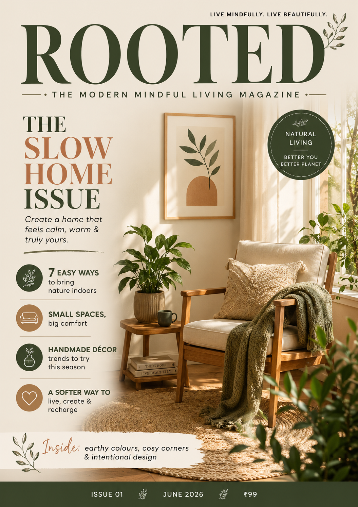

# ✨ Task 4 Completed | Magazine Cover Design

Sharing my fourth and final task from my Graphic Design Internship at SkillCraft Technology.

📌 Project Overview

For this task, I designed a magazine cover for ROOTED — The Modern Mindful Living Magazine.

The cover is based on “The Slow Home Issue”, focusing on calm interiors, natural living, handmade décor, and creating a space that feels warm and personal.

I used a soft earthy colour palette, large editorial typography, indoor greenery, and a cosy home setting to create a peaceful and premium magazine feel. Cover lines and visual elements were added to make the layout look like a complete magazine cover while keeping the main theme clear.
## 🎨 Magazine Cover Preview

✨ Key Design Elements

- Editorial Typography — Large, clear text creates a strong magazine-cover hierarchy.
- Earthy Colour Palette — Soft natural tones support the calm and mindful theme.
- Cosy Interior Visuals — Indoor greenery and warm décor reflect slow, intentional living.
- Balanced Cover Lines — Supporting text adds interest without distracting from the main title.
- Brand Consistency — The design connects with the natural, warm visual identity developed for Homefolk in earlier tasks.

🛠 Tools Used

- Canva
- Freepik

🌱 What I Learned

- How to create a magazine cover with a clear visual hierarchy.
- How typography, imagery, and spacing work together in editorial design.
- How to maintain a consistent visual identity across multipl## 🎨 Magazine Cover Preview

e brand materials.
- How design can communicate a calm mood and a clear publication theme.

---

Designed by: Sweta Kumari
Internship: Graphic Design Internship | SkillCraft Technology

#GraphicDesign #MagazineCoverDesign #EditorialDesign #LayoutDesign #Typography #BrandIdentity #MindfulLiving #HomeDecor #CanvaDesign #DesignInternship #SkillCraftTechnology
